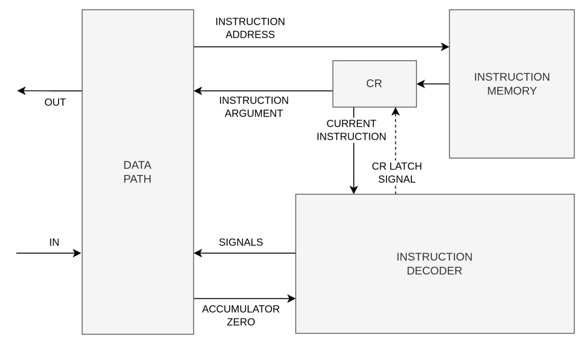
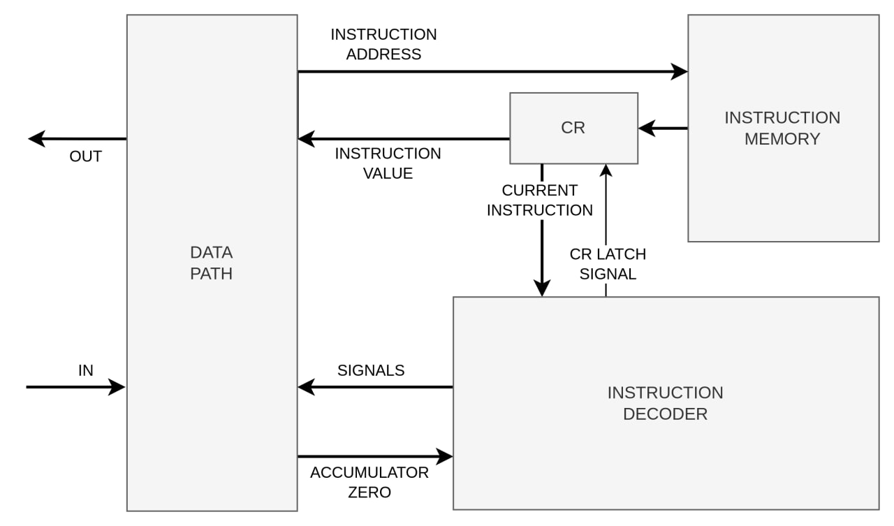

# Lisp. Транслятор и модель

- Лебедев Вячеслав Владимирович, P33312
- lisp | acc | harv | hw | tick | struct | stream | port | pstr | prob1 | 8bit
- усложнение `8bit` не реализовано

TODO:
- оптимизировать?
- объяснить подробнее каждое ключевое слово

## Язык программирования

### Синтаксис

```ebnf
<program>               := <expressions> EOF

<expressions>           := | <expressions> <expression>

<expression>            := <open-bracket> <bracketed-expression> <close-bracket> | <varname> | <literal>

<bracketed-expression>  :=  <function-definition> 
                            | <function-call> 
                            | <if-condition> 
                            | <binary-operation> 
                            | <unary-operator-expression>
                            | <assignment> 
                            | <loop-expression>
                            | <allocation>

<function-call>         := <varname> <arguments>

<arguments>             := | <arguments> <expression>

<function-definition>   := defun <varname> <open-bracket> <parameters> <close-bracket> <expressions>

<parameters>            := | <parameters> <varname>

<assignment>            := setq <varname> <expr>

<allocation>            := alloc <number-literal>

<if-condition>          := if <condition-expression> <true-expression> <false-expression>

<loop-expression>       := loop <condition-expression> <expressions> 

<binary-operator-expression> := <binary-operator> <expression> <expression>

<unary-operator-expression> := <unary-operator> <expression>

<binary-operator>       := store | mod | and | or | + | - | = | < | >

<unary-operator>        := not | put | load

<nullary-operator>      := get

<condition-expression>  := <expression>

<true-expression>       := <expression>

<false-expression>      := <expression>

<literal>               := <number-literal> | <string-literal> | <character-literal>

<number-literal>        := [0-9]+

<string-literal>        := "\w*"

<character-literal>     := '.'

<varname>               := [a-zA-Z\.]\w*
```

### Семантика

Каждая операция является `выражением`, т.е. в результате вычисления "возвращает" результат.
Выполнение программы представляет собой последовательное вычисление таких выражений.
Например, выражение `(+ 1 (+ 2 3))` вычисляется так: `(+ 1 (+ 2 3)) -> (+ 1 5) -> 6`.

`setq` - объявляет переменную (если не была объявлена) и присваивает ей значение.
Переменные имеют область видимости: глобальную - получают переменные объявленные снаружи функций, 
а локальную - параметры функции и переменные, объявленные внутри ее определения. 
При этом из глобальной области невозможно обратиться к локальным переменным функции, 
а из функции невозможно обратиться к глобальным переменным.

Код в глобальной области представляет собой список выражений, которые будут вычислены последовательно.
Тело функций тоже представляет собой список выражений, которые вычисляются последовательно.
При этом результат вычисления последнего выражения - является результатом функции.

Ключевые слова:

- `get` - прочитать байт
- `put` - вывести байт
- `alloc` - выделить буфер в статической памяти
- `load` - прочитать слово из ячейки по адресу
- `store` - загрузить слово в ячейку по адресу
- `setq` - присвоить значение переменной (и/или объявить переменную)
- `defun` - объявить функцию
- `loop` - выражение-цикл, выполняющийся до тех пор, пока истинно первое выражение внутри его тела
- `if` - условное выражение, если первое выражение вычисляется в ненулевое значение, то будет результатом будет второе выражение, если нет - третье

Литералы:
- `"Hello, world"` - строковый литерал
- `'a'` - символьный литерал
- 42 - числовой литерал

Пример кода:

```text
; <- комментарий

; | объявление функции
; v 
(defun sum(a b)
    (setq result (+ a b))   ; <- объявление локальной переменной и присвоение ей значения
    result                  ; <- последнее выражение = результат функции 
)

(setq magic 42)                 ; <- объявление глобальной переменнй
(loop (> magic 0)               ; <- условие цикла
    (setq magic (- magic 1))    ; <- тело цикла
)
```

### Типы данных

Существует единственный тип - 32-битное знаковое число, интерпретация которого ложится на плечи программиста.
Так, например, `(alloc <number>)` - выделить буфер размера `<number>` в статической памяти, возвращает число -
адрес буфера - от `0` до `2^24-1` (результат вычисления строкового литерала аналогичен).

## Организация памяти

1. Память команд. Машинное слово - `32` бит. Реализуется списком словарей, описывающих инструкции (одно слово - одна
   команда). Размер адресного пространства - `2^24` слов.
2. Память данных. Машинное слово - `32` бит, знаковое. Линейное адресное пространство. Реализуется списком чисел. Размер
   адресного пространства - `2^24` слов.

### Регистры

- `AC` (Accumulator) - аккумулятор, вокруг которого строится вычисление
- `CR` (Command Register) - используется для хранения текущей исполняемой инструкции
- `IP` (Instruction Pointer) - указатель инструкций
- `DR` (Data Register) - регистр данных (для работы с памятью и вводом/выводом)
- `AR` (Address Register) - адресный регистр (используется при чтении/записи в память)
- `SP` (Stack Pointer) - указатель стека
- `FP` (Frame Pointer) - указатель фрейма
- `BR` (Buffer Pointer) - используется во время выполнения промежуточных операций при исполнении инструкций

Так как это модель аккумуляторного процессора, то пользователь может явно работать только с аккумулятором.
Но помимо этого есть команды, которые неявно взаимодействуют с другими регистрами (`pop` - декремент указателя стека,
`jmp` - присвоить значение указателю инструкций).

### Виды Адресации

- `Absolute` - абсолютная, указывается адрес, где находится значение: `value = MEM[address]`
- `Relative` - относительная, указывается регистр и смещение `value = MEM[register + offset]`
- `Relative Inderect` - косвенная относительная, указывается регистр и смещение: `value = MEM[MEM[register + offset]]`

В качестве регистра можно указывать `Stack Pointer` и `Frame Pointer`.
Относительная адресация используется для работы со стеком и локальными переменными функций.

Число команд - 20, поэтому код инструкции имеет размер 5 бит (20 < 32 = 2 ^ 5).
Также, так как типов адресации - 4, то на их кодирование требуется еще 2 бита.
И 1 бит необходим для кодирования регистра при относительной адресации.
Остается 24 бита. Из-за этого адресное пространство ограничивается 24 битами,
поэтому память данных также ограничена: ее максимальный объем - 16777216 32-битных слов.

Команды перехода отнесены в отдельную категорию. Для таких команд можно задать только абсолютный адрес и 
это всегда адрес в памяти инструкций.

| Тип команды                 | Схема                                                  |
|-----------------------------|--------------------------------------------------------|
| `Default`                   | `[OPCODE: 5][RESERVED: 27]`                            |
| `Execution Flow`            | `[OPCODE: 5][RESERVED: 3][ADDRESS: 24]`                |
| `Absolute Address`          | `[OPCODE: 5][ADDRESSING: 2][RESERVED: 1][ADDRESS: 24]` |
| `Relative Address`          | `[OPCODE: 5][ADDRESSING: 2][REGISTER: 1][OFFSET: 24]`  |
| `Relative Inderect Address` | `[OPCODE: 5][ADDRESSING: 2][REGISTER: 1][OFFSET: 24]`  |

### Литералы

Каждый литерал является Lisp-выражением, таким образом в результате своего "вычисления" должен стать значением на стеке.

- строковые - сама строка помещается в статическую память, закодированную в pascal-style, после "вычисления" помещает
  адрес строки на стек
- числовые - при компиляции значение помещается в ячейку статической памяти, при "вычислении" на стек помещается
  число, вычитанное из статической памяти
- символьные - по организации в памяти аналогичны числовым литералам, по сути - являются макросом, чтобы не писать
  каждый раз ASCII код

### Размещение данных

```text
       Instruction memory
+------------------------------+
| 00  : nop  (program start)   |
|    ...                       |
| xx  : halt  (program stop)   |
|    ...                       |
| i   : nop  (function "foo")  |
| i+1 : function body          |
|    ...                       |
| j   : nop  (function "baz")  |
| j+1 : function body          |
|    ...                       |
+------------------------------+

          Data memory
+------------------------------+
| 00  : 42  (number literal)   |
|    ...                       |
| i   : 111 (char literal 'o') |
|    ...                       |
| j   : 5 (string literal)     |
| j+1 : 104 ('h')              |
| j+2 : 101 ('e')              |
| j+3 : 108 ('l')              |
| j+4 : 108 ('l')              |
| j+5 : 111 ('o')              |
|    ...                       |
| k   : 0 (static variable x)  |           ^
|    ...                       |           | 
| ff : ...                     | <- stack top
+------------------------------+
```

## Система Команд Процессора

### Набор инструкций

| №  | инструкция | эффект                              | тип         | описание                                                |
|----|------------|-------------------------------------|-------------|---------------------------------------------------------|
| 1  | `add A`    | `AC + MEM[A] -> AC`                 | с операндом | сложение знаковых числ                                  |
| 2  | `sub A`    | `AC - MEM[A] -> AC`                 | с операндом | вычитание знаковых числ                                 |
| 3  | `and A`    | `AC & MEM[A] -> AC`                 | с операндом | побитовое логическое "И"                                |
| 4  | `or A`     | `AC v MEM[A] -> AC`                 | с операндом | побитовое логическое "ИЛИ"                              |
| 5  | `not`      | `~AC -> AC`                         | безадресная | побитовое логическое "НЕ"                               |
| 6  | `ld A`     | `MEM[A] -> AC`                      | адресная    | загрузка значения в аккумулятор по адресу               |
| 7  | `st A`     | `AC -> MEM[A]`                      | адресная    | сохранение значения из аккумулятора по адресу           |
| 8  | `put`      | `AC -> IO`                          | безадресная | вывод значения из аккумулятора                          |
| 9  | `get`      | `IO -> AC`                          | безадресная | ввод значения в аккумулятор                             |
| 10 | `push`     | `SP - 1 -> SP`                      | безадресная | подъем указателя стека                                  |
| 11 | `pop`      | `SP + 1 -> SP`                      | безадресная | понижение указателя стека                               |
| 12 | `jmp A`    | `A -> IP`                           | перехода    | безусловный переход                                     |
| 13 | `jz A`     | `A -> IP, if AC == 0`               | перехода    | переход, если в аккумуляторе `0`                        |
| 14 | `call A`   | `IP -> STACK, FP -> STACK, A -> IP` | перехода    | вызов функции                                           |
| 15 | `ret`      | `STACK -> FP, STACK -> IP`          | безадресная | возврат из функции                                      |
| 16 | `ispos`    | `(AC > 0) -> AC`                    | безадресная | проверка, что в аккумуляторе строго положительное число |
| 17 | `isneg`    | `(AC < 0) -> AC`                    | безадресная | проверка, что в аккумуляторе строго отрицательное число |
| 18 | `iszero`   | `(AC == 0) -> AC`                   | безадресная | проверка, что в аккумуляторе `0`                        |
| 19 | `nop`      |                                     | безадресная | бездействие                                             |
| 20 | `halt`     |                                     | безадресная | остановка исполнения                                    |

### Исполнение инструкций

Исполнение инструкции проходит в 4 этапа:

1) `Instruction Fetch` (выборка инструкции) - из памяти инструкций выбирается текущая команда и увеличивается счетчик инструкций
2) `Address Fetch` (выборка адреса) - для адресных команд, команд с операндом и команд перехода
3) `Operand Fetch` (выборка операнда) - для команд с операндом
4) `Execution` (исполнение) - непосредственное исполнение команды

Instruction Fetch
```text
IMEM[IP] -> CR
IP + 1 -> IP
```

Address Fetch
```text
ABSOLUTE ADDRESS:
    CR[8:31] -> AR

RELATIVE ADDRESS:
    CR[8:31] + $reg -> AR

RELATIVE INDIRECT ADDRESS:
    CR[8:31] + $reg -> AR
    MEM[AR]         -> DR
    DR              -> AR

EXECUTION FLOW:
    CR[8:31] -> AR
```

Operand Fetch
```text
MEM[AR] -> DR
```

Execution
```text
add, sub, and, or:
    AC . DR -> AC

not:
    NOT(AC) -> AC
    
jmp:
    AR -> IP

jz:
    AR -> IP, if FLAGS[ZERO] == 1

call:
    AR      -> BR
    IP      -> DR       % save IP
    SP      -> AR
    DR      -> MEM[AR]
    SP - 1  -> SP
    FP      -> DR       % save FP
    SP      -> AR
    DR      -> MEM[AR]
    SP - 1  -> SP
    SP      -> FP
    BR      -> IP       % jump

ret:
    SP + 1  -> SP       % recover FP
    SP      -> AR
    MEM[AR] -> DR
    DR      -> FP
    SP + 1  -> SP       % recover IP
    SP      -> AR
    MEM[AR] -> DR
    DR      -> IP

ld:
    DR      -> AC

st:
    AC      -> DR
    DR      -> MEM[AR]
 
push:
    SP - 1  -> SP
 
pop:
    SP + 1  -> SP

put:
    AC      -> DR
    DR      -> IO

get:
    IO      -> DR
    DR      -> AC

ispos:
    (AC > 0) -> AC

isneg:
    (AC < 0) -> AC

iszero:
    (AC == 0) -> AC
```

### Соглашение о вызове функций

**Вызов**

Для исполнения Lisp функции, объявленной при помощи `defun`

`Caller`:

- на стек помещаются аргументы функции после вычисления `k` выражений (число аргументов всегда **равно** числу
  параметров функции)
- вызов инструкции `call A`:
    - на стек помещается адрес возврата (текущий `IP`)
    - сохраняется текущий указатель фрейма `FP`
    - устанавливается новый указатель фрейма функции: `SP -> FP`
    - происходит переход к функции: `A -> IP`

`Callee`:

- на стеке выделяется неинициализированная память для локальных переменных функции

**Выполнение функции и результат**

Выражения тела функции вычисляются последовательно. Последнее выражение - результат функции, помещается на стек.

**Возврат**

Результат функции - всегда **одно** слово, помещенное на стек

`Callee`:

- результат снимается со стека и сохраняется в аккумулятор
- снимаются локальные переменные - производится `n` вызовов `pop`
- вызов `ret` - восстанавливается предыдущий `Frame Pointer` и `Instruction Pointer`

`Caller`:

- снимаются аргументы функции - производится `k` вызовов `pop`
- результат из аккумулятора помещается на стек

Доступ к локальным переменным осуществляется при помощи относительной адресации в сторону младших адресов
`address_of(local_var[i]) = fp - i, где i = [0..n-1]`.

Доступ к аргументам тоже осуществляется относительно указателя фрейма,
но в сторону старших адресов: `address_of(arg[i]) = fp - i + k + 2, где i = [0..k-1]`
(смещение +2 появляется из-за того, что `FP` расположен на 2 адреса выше последнего параметра).

```text
0x0000  | ...            | 
        :                :
        |                | <- SP
        | result         | 
        | local var n-1  |
        | ...            |
        | local var 0    | <- FP    % frame i + 1
        +----------------+
        | old frame ptr  |
        | return address |
        | arg k-1        |
        | ...            |
        | arg 0          |
        | ...            |          % frame i
        :                :
0xffff  | ...            |
```

### Кодирование инструкций и данных

- Машинный код сериализуется в список JSON.
- Один элемент списка - одно машинное слово, одна инструкция
- Индекс списка - адрес инструкции, используется при командах перехода

Пример:

```json
[
  {
    "opcode": "ld",
    "address": {
      "type": "absolute",
      "value": 0
    },
    "debug": "variable value [char]",
    "index": 11
  },
  {
    "opcode": "sub",
    "address": {
      "type": "relative",
      "register": "sp",
      "offset": 1
    },
    "index": 15
  },
  {
    "opcode": "jz",
    "address": {
      "type": "control-flow",
      "value": 98
    },
    "debug": "jump if false",
    "index": 84
  },
  {
    "opcode": "push",
    "index": 12
  }
]
```

где:

- `opcode` - строка с кодом операции
- `address` - для команд перехода - адрес инструкции, для адресных команд - адрес (абсолютный, относительный,
  косвенный)
- `debug`, `index` - дополнительная информация для дебага, не используется при исполнении инструкции

Типы данных описаны в [isa](translator/isa.py), где:

- `Opcode` - перечисление кодов операций;
- `Addressing` - перечисление типов адресации
- `Register` - перечисление регистров, используемых для относительной адресации

Статическая область памяти сериализуется в виде JSON массива чисел

Пример:
(`"hello"` закодированное в виде Pascal строки)

```json
[
  5,
  104,
  101,
  108,
  108,
  111
]
```

## Транслятор

Интерфейс командной строки: translator.py <input_file> <target_file>

Состоит из 4 основных файлов:

- [lexer.py](lexer.py)
- [parsing.py](parsing.py)
- [compiler.py](compiler.py)
- [translator.py](translator.py)

### Лексер

Содержит перечисления для токенов, а также соответствующие им regex паттерны, описанные в виде элементарных регулярных выражений.
А также два класса - `Lexer` и `Token`. `Lexer` содержит основную логику по разбиению исходного кода на токены.
А класс `Token` в себе инкапсулирует информацию о токене (тип, дополнительная информация).

### Парсер

На основе токенов, полученных от лексера формирует абстрактное синтаксическое дерево.
Внутри файла объявлены классы - узлы дерева. А также класс `Parser`, содержащий в себе основную логику по 
его формированию.

Парсер объединяет токены в узлы дерева по правилам, описанным выше в форме Бэкуса-Нуара.

### Компилятор

Получает на вход абстрактное синтаксическое дерево от парсера, на основе которого формирует
линейный код в виде списка инструкций, описанных в [isa.py](isa.py).

Внутри файла находится 3 основных класса:

- `DataSegment` - управляет размещением статических данных
- `TextSegment` - управляет размещением инструкций в сегменте кода
- `Compiler` - содержит основную логику по преобразованию `AST` в код

Основное правило компиляции - каждое Lisp-выражение должно быть преобразовано в
значение на стеке. Таким образом, каждое выражение помещает результат на стек, а
вызвавшее его выражение - снимает его и использует в вычислении.

Иногда это может привести к избыточной работе со стеком, но зато упрощает процесс
написания компилятора и избавляет от необходимости думать о состоянии аккумулятора
и размещении переменных.

### Транслятор

- соединяет исходный код со стандартной библиотекой
- использует перечисленные файлы для преобразования исходного кода
- обеспечивает работу с командной строкой

## Модель процессора

Интерфейс командной строки: machine.py <machine_code_file> <input_file>

Реализовано в модуле: [machine](machine.py).

### Data Path



### Control Unit


